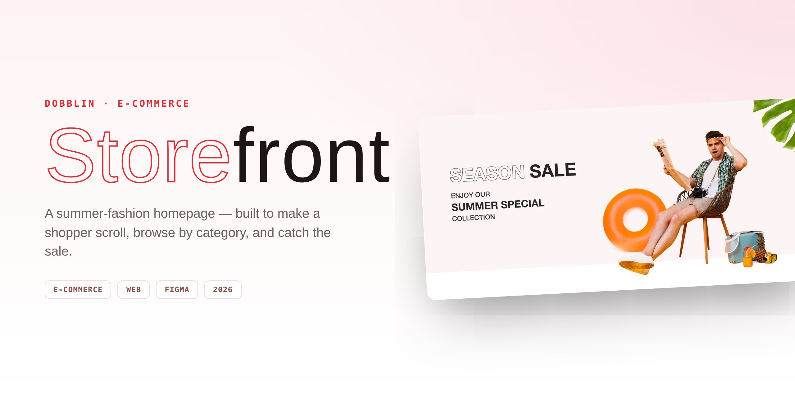

# Dobblin — Storefront

> Homepage design for a summer-fashion D2C brand — built to make a shopper
> scroll, browse by category, and catch the sale before they bounce.

**▶ [View the live case study](https://dhaval-sukharamwala.github.io/dobblin-storefront-case-study/)**

| | |
| :--- | :--- |
| **Role** | Product Designer |
| **Surface** | Desktop web |
| **Tools** | Figma |
| **Year** | 2026 |

## Overview

A direct-to-consumer apparel brand spanning menswear, womenswear and Indian
ethnic. The homepage has one job: turn a curious tap into a browse, and a browse
into a basket — opening on the seasonal sale, then fanning the broad catalogue
out into six clear, tappable categories.

## Highlights

- **Nine sections** sequenced as a shopping journey: sale → categories →
  best-sellers → him/her → new arrivals → brand → product rails → new collection
  → join the club.
- **One product card** repeated everywhere it counts — photo, name, price,
  struck-through MRP, and the savings in green.
- **An outlined-type signature** that carries the brand's loud moments without
  overwhelming the product.

## More

Full visual breakdown on **[Behance](https://www.behance.net/your-handle)**.

---

Designed by Dhaval Sukharamwala · 2026
